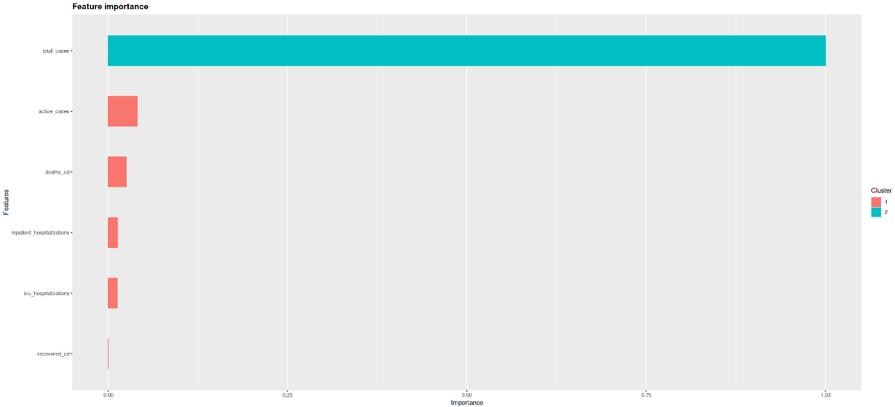
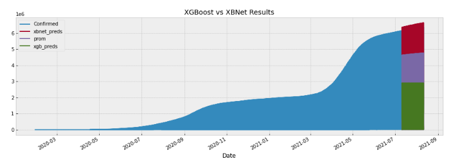

# Description of this portfolio

This portfolio contains my notebooks about machine and deep learning algorithms applied on **time series data**. This data was downloaded from different sources and it's freely availble. If you can't see my notebooks here, you can use [nbviewer](https://nbviewer.org/). The notebooks are described below: 

## 1.  [XGBoost for COVID-19 time series data](notebooks/xgboost-for-time-series-forecasting-r.ipynb) 

The purpose here was to do baselines using **XGBoost**. The code was written using **R** and its ecosystem (e.g. **tidyverse**). The data it's about COVID-19 and comes from several countries. After training, i computed **feature importance** to give explainability to the model.

  

## 2. [XBNet vs XGBoost Predictions on COVID-19 data](notebooks/xbnet-regressor-for-covid-19-data.ipynb)

[XBNet](https://paperswithcode.com/paper/xbnet-an-extremely-boosted-neural-network) (**Extremely Boosted Neural Network**) it's another neural network specially designed for tabular data. As the name allows to infer, it uses an approach similar to **XGBoost**. Here, the predictions made with XBNet are better than XGBoost.

## 3. [GBM + NNs, TabNet, XGboost and more for COVID-19 data](notebooks/gbr-nn-tabnet-xbnet.ipynb)

This is a kind of benchmark of several models trying to find the best one to model COVID-19 data from India. It's interesting how the **TensorFlow** ecosystem allows to connect the outputs of a neural network to a **gradient boosting machine** using **TensorFlow Decision Forest** library. I also used **TabNet**, an amazing neural network architecture which has a realy good performance on gene expression data.  

## 4. [A Predictor for Batery's data](notebooks/fiverr-bateria.ipynb) 

As freelancer I'm not always allowed to share code, however, I don't have any problem with this piece of code. Here, again a benchmark is showed, with interesting models like **Temporal Convolutional Netowork (TCN)** and more.

**Contact**: hiramcoria@gmail.com